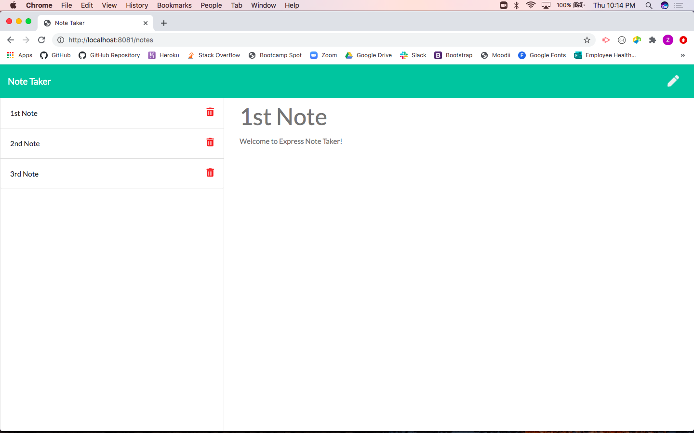

# Express Note Taker

Deployed App:

## Description
Express Note Taker is an application that can be used to write, save, and delete notes. This app uses an express backend and save & retrieve note data from a JSON file.

AS A user, I want to be able to write and save notes

I WANT to be able to delete notes I've written before

SO THAT I can organize my thoughts and keep track of tasks I need to complete

## Table of Contents
* [Installation](#installation)
* [Usage](#usage)
* [Contributing](#contributing)
* [License](#license)
* [Test](#test)
* [Questions](#questions)

## Installation

## Usage

## Contributing
None

## License
Unlicense

## Tests
No test

## Questions
Contact Me:

Github: [FullStackZack](https://github.com/FullStackZack)

Email: [zhwhite18@yahoo.com]